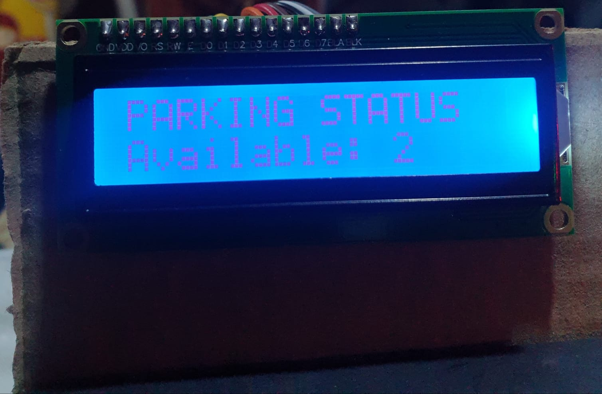

# Smart Parking System

## Project Overview
The Smart Parking System is a prototype designed to manage parking availability using computer vision, sensors, and microcontroller-based control. The system detects incoming vehicles using a camera, checks parking availability, and automatically controls a gate barrier. Additionally, it provides real-time parking status using LEDs and an LCD screen.

This project demonstrates the feasibility of integrating software and hardware components into a functional smart parking solution.

---

## System Architecture
The system is divided into two main components:

### 1. Hardware (ESP32)
- ESP32 microcontroller
- Servo motor for gate control
- IR / LDR sensors for parking spot detection
- LEDs (Red / Green) to indicate parking status
- 16x2 LCD to display parking availability

### 2. Software (Python)
- Python application running on a PC
- OpenCV used for vehicle detection via camera
- Serial communication with ESP32 to send gate control commands

 
## Key Features
- Vehicle detection using a camera (OpenCV)
- Automatic gate control using a servo motor
- Parking availability calculation using sensors
- Real-time status display on LCD screen
- Visual indication using red and green LEDs
- Serial communication between Python application and ESP32

---
## Screenshots

---

## Technologies Used
- Python (OpenCV, PySerial)
- Arduino IDE
- ESP32 Microcontroller
- GitHub for version control

---

## Notes
This project represents a functional prototype developed during GP1. The implemented components demonstrate the feasibility of the proposed system architecture and serve as a foundation for further development in GP2.
